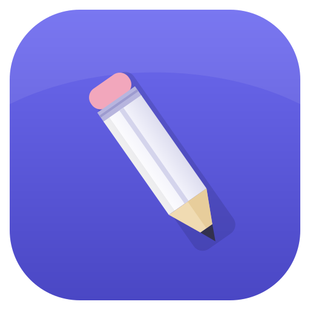

<p align="center">
  
</p>

<h1 align="center">Words</h1>

<p align="center">
  A macOS menu bar app that counts the <b>words</b>, characters, and <b>tokens</b>
  you type — everywhere, all day — into a local SQLite database you can build on.
</p>

---

Like [WordCounter](https://wordcounterapp.com/), but always-on, system-wide,
token-aware, and backed by a database you own.

- **Lives in the menu bar** as `✎` + today's word count.
- **Left-click** opens a popover dashboard; **right-click** opens a menu
  (start at login, open the database folder, quit).
- **Starts at login by default** — toggle it from the right-click menu.
- **Today / Week / Month** views, each with a histogram, a per-app breakdown
  (with real app icons), and a **Words ⇄ Tokens** toggle.
- **Tokens** are computed locally with the `o200k_base` BPE (the tokenizer used
  by recent OpenAI models — a close approximation for LLM budgeting). Fully
  offline; no API key, nothing sent over the network.
- Counts are attributed to the frontmost app and bucketed per hour.

## Privacy

**No typed text is ever written to disk.** Text lives only transiently in memory
long enough to be tokenized, then it's discarded — only aggregate counts are
stored. Password fields are automatically excluded (macOS turns on secure
keyboard entry for them, so those keystrokes never reach the app).

## Storage

SQLite database at:

```
~/Library/Application Support/word-counter/counts.db
```

Schema (WAL mode, so other tools can read it live):

```sql
CREATE TABLE counts (
    hour_start    INTEGER NOT NULL,  -- unix epoch seconds, truncated to the hour (UTC)
    app_bundle_id TEXT    NOT NULL,  -- e.g. "com.apple.Notes"
    words         INTEGER NOT NULL DEFAULT 0,
    tokens        INTEGER NOT NULL DEFAULT 0,
    chars         INTEGER NOT NULL DEFAULT 0,
    PRIMARY KEY (hour_start, app_bundle_id)
);
```

Example queries:

```sql
-- Words written today, by app
SELECT app_bundle_id, SUM(words) AS words
FROM counts
WHERE hour_start >= strftime('%s', 'now', 'start of day')
GROUP BY app_bundle_id ORDER BY words DESC;

-- Tokens per hour of day, all time
SELECT (hour_start % 86400) / 3600 AS utc_hour, SUM(tokens)
FROM counts GROUP BY utc_hour ORDER BY utc_hour;
```

## Build & install

```sh
# One-time: a stable self-signed cert so the Accessibility grant survives
# rebuilds (you'll be asked for your login password once). Recommended.
./packaging/make-cert.sh

# Build and assemble dist/Words.app (signs with the cert if present)
./packaging/build-app.sh

open "dist/Words.app"
```

On first launch, grant Accessibility in **System Settings → Privacy & Security →
Accessibility** (this is what lets the app observe your keystrokes). The app also
registers itself to **start at login** by default — toggle this from the
right-click menu, or manage it under **System Settings → General → Login Items**.

### Don't see the menu bar icon?

On MacBooks with a notch, a **full menu bar** can push a newly added icon behind
the notch where it's hidden. The app is still running — free up menu bar space,
⌘-drag icons to rearrange, or use a menu bar manager like
[Ice](https://github.com/jordanbaird/Ice). You can confirm the icon exists and
its position with:

```sh
osascript -e 'tell application "System Events" to tell process "word-counter" \
  to get {position, value of attribute "AXTitle"} of menu bar item 1 of menu bar 1'
```

## How counting works (and its limits)

Counts are derived from keystrokes, so they're a close approximation rather than
an exact document word count:

- **Pasted text (⌘V) is not counted** — a paste isn't keystrokes.
- Heavy editing and cursor jumps are handled best-effort: navigation keys flush
  the current buffer so counts don't drift wildly, but rewriting a paragraph
  counts the new keystrokes, not net document change.
- Tokens are counted over short in-memory spans and summed — a very close
  approximation of tokenizing the whole text at once.

## Project layout

```
src/main.rs               Main-thread event pump + app setup
src/ui.rs                 NSStatusItem + NSPopover + WKWebView, right-click menu, app icons
src/dashboard.html        The popover UI (rendered in the web view)
src/tap.rs                CGEventTap keyboard capture, frontmost app, Accessibility prompt
src/worker.rs             Transient buffer, tokenization, flush-to-DB
src/db.rs                 SQLite schema, upserts, range/snapshot queries
src/events.rs             Shared message + state types
packaging/                Info.plist, build-app.sh, make-cert.sh, make-icon.sh
assets/logo.svg           App logo (source of AppIcon.icns)
assets/menubar-pencil.svg Menu bar template icon (source of the @2x PNG)
```

The app icon (`assets/AppIcon.icns`) and menu bar image (`assets/menubar-pencil@2x.png`)
are committed. If you edit the source SVGs, regenerate the icon with
`./packaging/make-icon.sh` (needs ImageMagick).

> The Cargo package and binary are still named `word-counter`, and the bundle
> identifier stays `com.d4hines.word-counter` — this keeps your Accessibility
> grant attached across the rename to **Words**.

## License

MIT — see [LICENSE](LICENSE).
